# Estrategias de observabilidad y resiliencia.

## Documentacion de entrega
   Los documentos solicitados se encuentran en la carpeta *[documentacion](https://github.com/fagustin07/infobaearqsoft2/tree/main/documentacion)*.
## Requerimientos para correr la aplicacion
- [Docker](https://docs.docker.com/get-docker/). 🐳
- [Docker Compose](https://docs.docker.com/get-docker/). 🐳

## Deseable
- [Editor de Texto](http://territoriogo.blogspot.com/2018/10/que-editor-utilizar-para-programar-en-go.html). 📝

# Correr la app.
1. Solicitar las credenciales necesarias para que el servicio de Loader funcione correctamente. Luego, colocarlas en `loader-service/main/resources/application.properties` en los parametros correspondientes que son: api key y base de datos.
2. Una vez configurado el archivo mencionado, simplemente debemos ejecutar `docker compose up --build`.
3. En nuestro navegador podremos ingresar a las siguientes urls:
   - http://localhost:9000, donde veremos los protocolos de comunicacion del componente Metric realizado con Swagger.
   - http://localhsot:8080, donde veremos los protocolos de comunicacion del componente Loader realizado con Swagger.
   - http://localhost:9411, donde veremos la UI de Zipkin, la herramienta utilizada para Distributed Tracing.
   - http://localhost:5601, donde veremos la UI de Kibana, la herramienta que muestra los logs centralizados de ambos componentes, que fueron recompilados con el stack ELK.
   - http://localhost:3000, donde veremos la UI de Grafana, la herramienta con la que visualizamos las metricas de los componentes y a su vez realizamos la configuracion del alerting.

## Tests de carga

### Requerimientos

- [JMeter](https://jmeter.apache.org/). 🪶
- Aplicacion levantada con docker compose.

### Ejecutar los tests de carga

Para correr los tests simplemente abrimos nuestro JMeter y le cargamos el archivo que se encuentra en `pruebas de carga/INFOBAE UNQ.jmx` dentro del proyecto. Ahi mismo ya podemos comenzar a ejecutar los tests, o bien reconfigurar los parametros para adaptarlo a lo que uno desee ver.

### Configuracion de Grafana
1. El usuario por defecto es 'admin' como usuario y pass.
2. En la esquina superior izquierda, tocamos y vamos a la seccion de `Connections`.
3. Buscamos y clickeamos en `Prometheus`
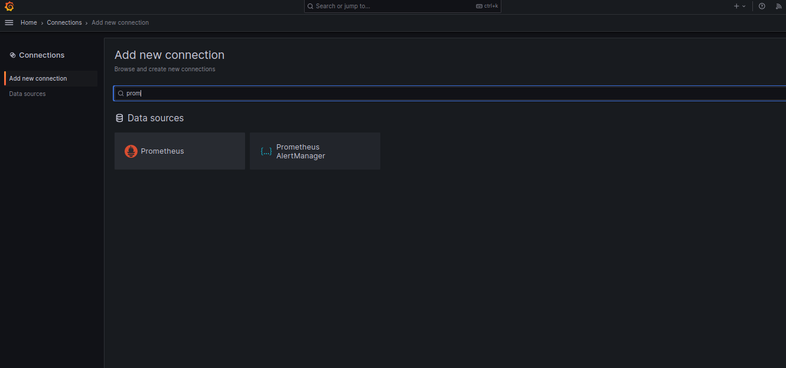
4. Clickeamos en `Create a Prometheus data source` en la esquina superior derecha.
5. En el parametro `Prometheus server URL` colocamos `http://prometheus:9090`
6. Vamos hasta el final de la pagina y tocamos en `Save & Test`
7. Ahora vamos a la esquina superior derecha y clickeamos en `Dashboards`.
8. Importamos un dashboard
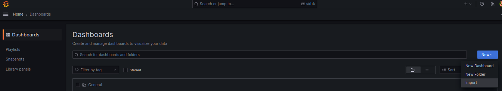
9. En `Import via grafana.com` pegamos `11378` y clickeamos en el boton de load que se encuentra al lado.
10. Configuramos el data source con el nombre que le pusimos y tocamos en `Import`.
11. Ya estariamos visualizando el tablero.
12. Clickeamos en los tres puntitos de CPU Usage, y luego `Edit`.
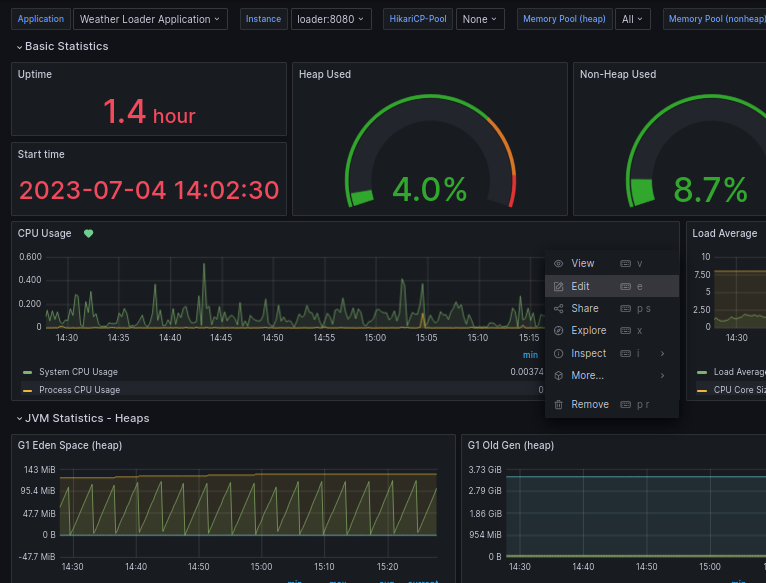
13. Vamos a la seccion Alert, y clickeamos `Create alert rule from this panel`.
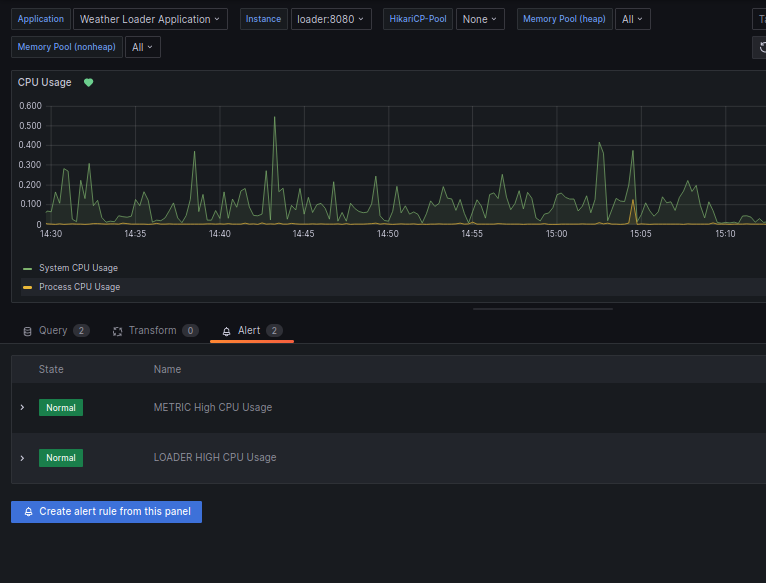
14. Copiamos la configuracion de la captura para obtener una alerta de CPU al 70% y damos en `Save rule and exit`.
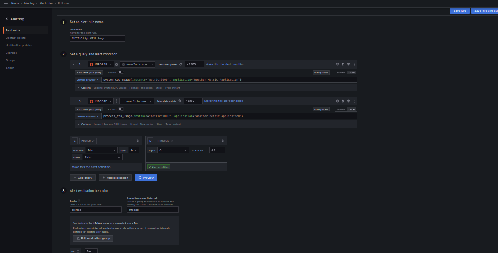
15.  Abrimos las opciones de la aplicacion y vamos a `Alert rules`.
16.  Seguimos las indicaciones del siguiente video para poder configurar un WebHook de Slack en Grafana https://www.youtube.com/watch?v=lWd4r44bHHo&t=998s .
17.  Luego, en `Notification Policies` configuramos que nuestro contacto sea el por defecto de las alertas.
18.  Listo, nuestra alerta estaria configurada.

### Configuracion de Kibana
1. Buscamos en la consola la url que genera Kibana con un codigo para poder ingresar a la interfaz, la copiamos con el codigo y ya tendremos acceso a Kibana.
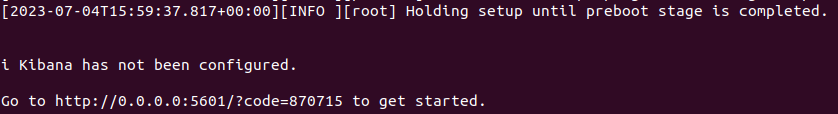
1. Presionamos el icono de hamburguesa sobre la izquierda superior y debajo de todo en la opcion `Managenment`.
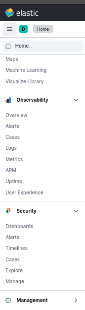
1. Clickeamos en `Data Views`.
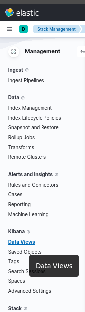
1. En la esquina superior derecha clickeamos en `Create data view`.
2. en `Name` configuramos lo siguiente y le damos a `Create data View` en el margen inferior (en la captura aparece el error en rojo porque ya lo tenemos creado).
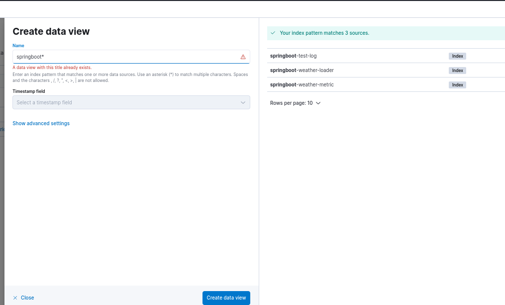
1. Vamos a la seccion `Discover`.
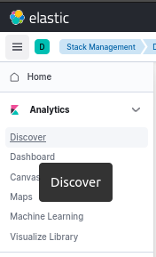
1. Ya podremos visualizar los logs de forma centralizada.
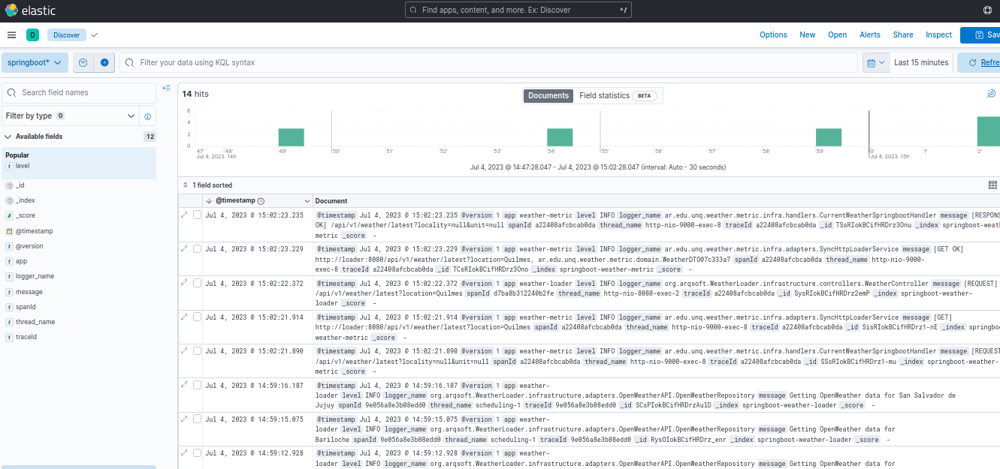

*Autores: Mauro Bailon, Federico Sandoval.*